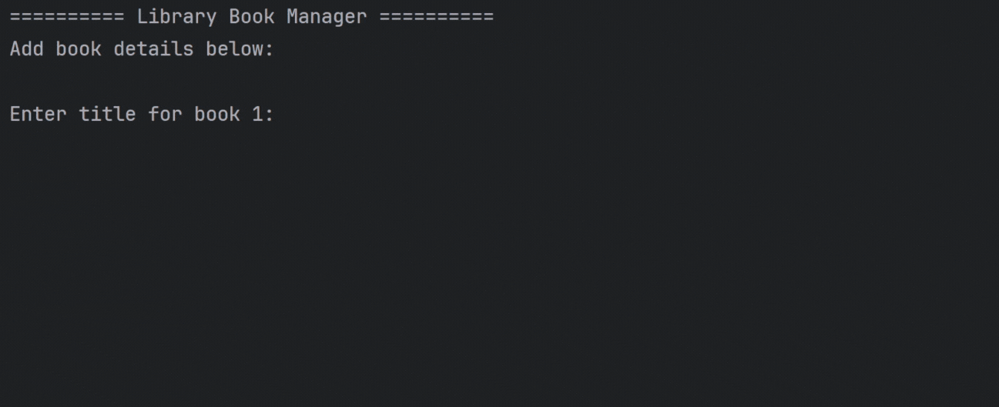

# 📚 Library Book Manager

**Library Book Manager** is a simple yet powerful Java console application developed using **IntelliJ IDEA**. It allows users to update the **title** or **ID** of two predefined books interactively through a command-line interface. The program showcases the use of loops, conditionals, user input with `Scanner`, and basic object-oriented programming principles.

---

## ✨ Features

- 📘 Update the **Title** or **ID** of Book 1 or Book 2
- 🔄 Continuous update loop until the user exits
- 🤖 Input handling using `Scanner`
- 📊 Displays final state of both books after updates

---

## 🎬 Demo Walkthrough

### 🟢 1. Intro – Program Startup


---

### ❌ 2. User Says "No" – Program Exits Without Making Changes


---

### ✅ 3. User Says "Yes" – Updates Book Info


---

## 🖥️ How to Run

1. **Clone this repository**:
```bash
git clone https://github.com/Saswat-King/library-book-manager.git
cd library-book-manager
```

2. Navigate to the src/ folder:

```
cd src
```

3. Compile the program:

```
javac LibraryBookManager.java
```

4. Run the program:

```
java LibraryBookManager
```


> 💡 Using IntelliJ IDEA?
Just open the project, open LibraryBookManager.java, and click the Run button.


---

📚 More Projects <br>
Check out more of my projects on my [GitHub profile](https://github.com/Saswat-King)
